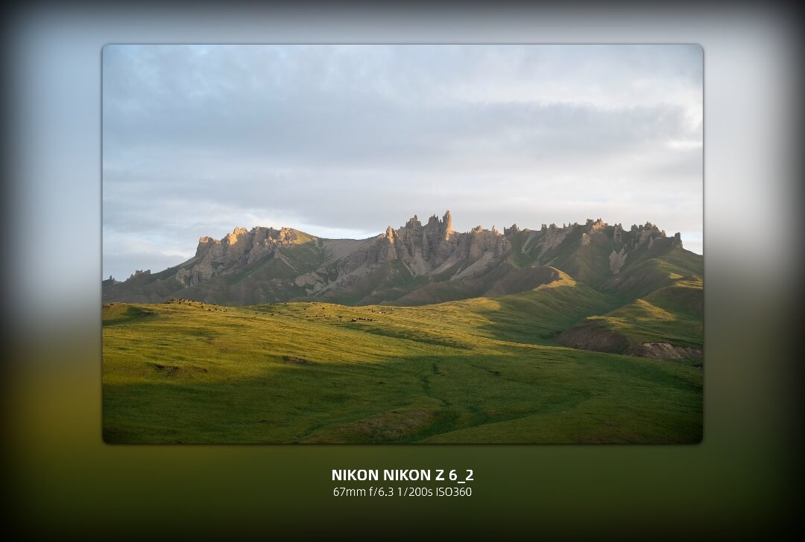

# Photix Mark Web

<div align="center">
  <a href="https://mark.photix.cc" target="_blank">
    
  </a>
  <br>
  <p><strong>Batch process and add professional watermarks to your photos.</strong></p>
  <p>
    <a href="https://mark.photix.cc"><strong>Live Demo</strong></a>
  </p>
</div>

<p align="center">
  <a href="./LICENSE"></a>
  
  
</p>

---

[简体中文](README.md) | [English](#english)

---

## English

### ✨ Features

- **Pure Frontend**: All processing is done in your browser. No server, no data upload, your privacy is 100% protected.
- **Batch Processing**: Watermark multiple images at once, saving you a great amount of time.
- **EXIF Data**: Automatically reads and displays EXIF information from your photos, such as camera model, lens, and shutter speed.
- **Live Preview**: Dual preview modes (Grid & Carousel) to check the result before processing.
- **Highly Customizable**: A powerful template system allows you to customize watermark content, logo, colors, and layout.
- **Smart Download**: Single images are downloaded directly, while multiple images are automatically zipped for your convenience.

### 🚀 Tech Stack

- **Framework**: Nuxt 3 + Vue 3 + TypeScript
- **UI**: Tailwind CSS
- **Image Processing**: HTML5 Canvas API
- **EXIF Parsing**: `exifr`
- **ZIP & Download**: `JSZip` + `file-saver`

### 🛠️ Getting Started

#### 1. Clone the repository
```bash
git clone https://github.com/dsleoon/photix-mark-web.git
cd photix-mark-web
```

#### 2. Install dependencies
```bash
npm install
```

#### 3. Run the development server
```bash
npm run dev
```
The application will be available at `http://localhost:3000`.

### 📖 How to Use

1.  **Upload Images**: Drag and drop your photos (JPG, PNG, HEIC) or click to select them.
2.  **Choose a Template**: Select a preset watermark template that fits your style.
3.  **Configure Parameters**: Adjust settings like EXIF fields, logo, colors, and positioning.
4.  **Preview**: Use the grid or carousel view to inspect the final look.
5.  **Process & Download**: Click the "Start Processing" button to generate and download your watermarked photos.

### 🤝 Contributing

We welcome all contributions! Whether you're fixing a bug, adding a feature, or improving documentation, your help is appreciated. Please feel free to open an issue or submit a pull request. Let's build this together!

### 📧 Contact

- **Author**: Leoonliang
- **Email**: dsleoon@gmail.com
- **Website**: [mark.photix.cc](https://mark.photix.cc)

### 📄 License

This project is licensed under the **MIT License**. See the [LICENSE](./LICENSE) file for details.
